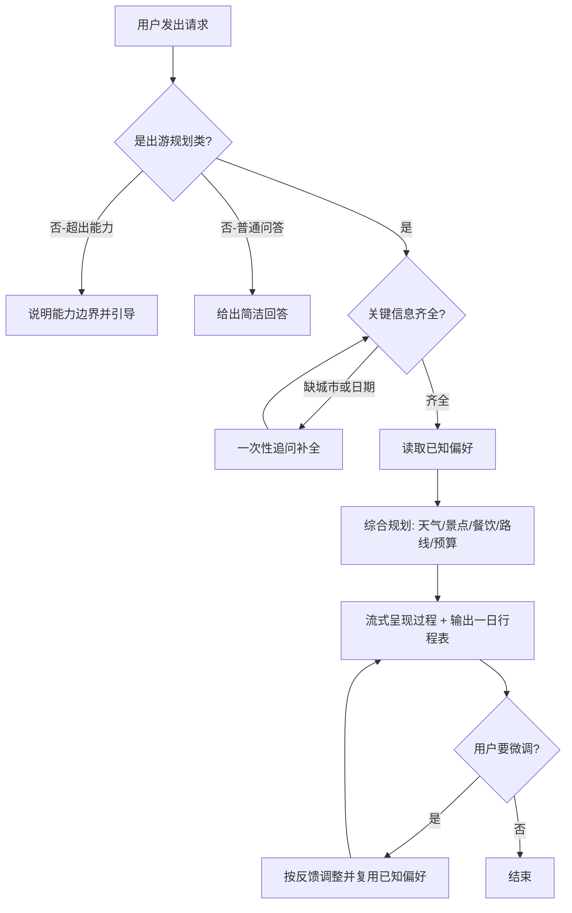

# alpha 产品需求文档（PRD）· 一日游规划助手

| 项 | 内容 |
|---|---|
| 文档版本 | v0.1（草稿） |
| 日期 | 2026-06-06 |
| 状态 | 待评审 |
| 范围声明 | **本文仅描述产品需求（做什么、为谁做、做到什么程度），不涉及技术方案与实现。** 技术设计与实现计划在后续独立轮次进行。 |

---

## 1. 背景与目标

### 1.1 项目背景
`agent-minimal` 是一个最小多 Agent 应用骨架（FastAPI 路由 + 多个互相独立的 agent 模块 + React 工作台，经 SSE 流式对接前端）。alpha 是其中一个待建设的 agent。

alpha 定位为**学习型 agent**：通过一个**真实、具体的业务场景**，完整承载一个 agent 应有的核心能力——理解需求、规划任务、调用能力、多步执行、记住偏好。经评估，「一日游/出游方案规划」既是真实需求、又能自然串起上述完整能力链，因此选为 alpha 的落地场景。

### 1.2 产品目标
让用户用**一句话**说出出游意图（去哪、什么时候、和谁、什么偏好），alpha 就能产出一份**可直接参考的一日游方案**：包含天气、景点、餐饮、路线与预算，并能在多轮对话中按用户反馈微调、记住用户偏好。

### 1.3 非目标（本轮 / 本产品阶段不做）
- 不在本文给出任何技术方案、架构、数据结构或实现细节。
- 产品上不做真实预订、下单、支付、实时导航。
- 不做多日 / 多城市行程（仅"一日 + 单城市"）。
- 不保证信息实时准确（方案为参考性质，详见 §5、§10）。

---

## 2. 目标用户与场景

### 2.1 用户画像
- **主要用户**：想快速得到某城市一日游安排、不愿自己逐项查攻略的普通用户。
- **次要用户**：学习 / 维护本项目的开发者（alpha 是其学习 agent 能力的载体）。

### 2.2 典型用户故事
- 「我周六想去杭州玩一天，帮我安排一下。」
- 「带爸妈一起，节奏慢点，预算控制在 500 以内。」
- 「景点太多了，砍到 3 个就行。」（多轮微调）
- 「换个便宜点、辣一点的餐厅。」（基于偏好的调整）
- 「帮我写首诗。」→ 期望 alpha 识别出这不是出游需求，礼貌说明自己能做什么。

---

## 3. 功能需求

> 用 F1–F5 描述产品要具备的能力，均以"用户视角的行为"表述。

### F1 需求理解与追问
- 接受**自然语言**输入，从中抽取出游要素：城市（必填）、日期、同行人、预算、兴趣、节奏等。
- 当**关键信息缺失**（至少缺城市或日期）时，主动追问补全；追问应**一次性问清**，避免反复打断。
- 非关键信息缺失时，采用合理默认（如未给节奏默认"适中"），并在方案中说明所用假设。

### F2 请求识别与能力边界
- 能区分请求类型：**出游规划类**走完整规划；**普通问答类**给简洁回答；**超出能力类**礼貌说明 alpha 的定位与可做的事，并引导用户回到出游场景。
- 边界识别对用户透明：用户应能清楚知道"alpha 现在在做什么、能做什么"。

### F3 出游方案规划（多方面综合）
对一次出游需求，alpha 需综合以下方面，缺一不可：
1. **天气**：当日天气提示及对行程的影响建议。
2. **景点**：结合城市与兴趣，给出适量景点（受"节奏"影响数量）。
3. **餐饮**：午餐、晚餐推荐，尊重忌口与口味偏好。
4. **路线**：景点游览顺序与景点间交通建议。
5. **预算**：分项与合计估算，贴合用户预算档位。

各方面需被**综合**为一份连贯方案，而非彼此孤立地罗列。

### F4 方案呈现
- **过程可见**：规划进行中向用户流式反馈进展（如"正在看天气 / 正在找景点…"），避免长时间无响应的等待感。
- **结构化产出**：最终输出一份**一日行程表**，字段规格见 §7。
- 复用工作台现有的对话式 + 流式呈现体验。

### F5 偏好记忆与多轮微调
- 在对话过程中**记住用户偏好**（忌口、预算档、出行节奏、兴趣类型、已去过/不想去的地点）。
- 后续轮次**无需重复告知**已知偏好；用户给出新偏好或修改时，方案随之调整。
- 支持基于上一版方案的**增量微调**（增减景点、换餐厅、调预算等），而非每次从零重来。

---

## 4. 功能边界

| 维度 | 范围内（做） | 范围外（不做 / 后续） |
|---|---|---|
| 行程跨度 | 一日、单城市 | 多日、多城市、跨城联程 |
| 信息动作 | 给出参考性方案 | 真实预订 / 下单 / 支付 / 实时导航 |
| 信息时效 | 参考性信息（声明非实时） | 保证实时、精确、可成交的数据 |
| 交互 | 自然语言多轮、流式呈现 | 表单填写、地图可视化、语音 |
| 记忆 | 对话过程中记住并复用偏好 | 跨设备 / 长期持久化的用户档案 |
| 能力边界 | 出游规划 + 简单问答 + 礼貌拒答 | 与出游无关的复杂任务 |

---

## 5. 用户交互流程

---

## 6. 输入规格

| 要素 | 是否必填 | 缺失处理 |
|---|---|---|
| 城市 | 必填 | 追问 |
| 日期 | 必填（影响天气） | 追问 |
| 同行人 | 可选 | 默认"成人独自/朋友" |
| 预算 | 可选 | 默认"适中" |
| 兴趣 | 可选 | 结合城市给通用热门 |
| 节奏 | 可选 | 默认"适中" |

输入形式：自然语言；偏好可在任意一轮补充，alpha 应即时纳入。

---

## 7. 输出规格（一日行程表）

一份完整方案应包含：

1. **概览**：城市、日期、天气提示、一句话总结。
2. **时间轴**：上午 / 中午 / 下午 / 晚上各段，含地点或活动 + 建议时长。
3. **餐饮**：午餐、晚餐推荐（口味/人均，尊重忌口）。
4. **路线**：景点游览顺序 + 景点间交通方式建议。
5. **预算**：分项估算 + 合计，贴合预算档位。
6. **贴士**：1–2 条注意事项（如天气应对）。
7. **时效声明**：信息可能非实时，仅供参考。

---

## 8. 验收标准

- **AC1**：给定"城市 + 日期"，能产出一份字段完整（天气/景点/餐饮/路线/预算齐全）的一日游方案。
- **AC2**：关键信息缺失时会追问，且补全后能继续完成方案。
- **AC3**：对非出游类请求，能正确识别并礼貌说明能力边界，不强行规划。
- **AC4**：多轮对话中，能根据用户偏好调整方案，且不重复追问已知偏好。
- **AC5**：规划过程对用户可见（有流式进展反馈），最终方案结构化、可读。
- **AC6**：方案明确标注"信息仅供参考"。

---

## 9. 非功能性需求（轻量，学习项目级）

- **响应体验**：采用流式输出，避免长时间无反馈。
- **一致性**：复用 `agent-minimal` 既有的前端对接体验与对话契约。
- **独立性**：alpha 自包含，不影响工作台中其他 agent 的运行。
- **可理解性**：作为学习载体，行为应清晰、可解释（用户能看懂它在做什么）。

---

## 10. 约束与假设

- 学习项目，遵循"最小可运行优先，不过度设计"。
- 复用现有多 agent 骨架的对接方式与工作台 UI。
- 当前阶段信息为参考性质（不接入需保证实时准确的数据源）；真实数据源接入列为未来项。

---

## 11. 未来规划（本阶段明确不做）

- 接入真实数据源（天气 / 景点 / 餐饮 / 票务等），提升信息时效与准确度。
- 多日、多城市行程。
- 真实预订 / 下单能力。
- 跨会话、跨设备的长期用户偏好档案。
- 地图可视化、行程导出/分享。

---

## 12. 待确认问题（Open Questions）

1. 目标城市范围：是否限定国内城市，或不限？
2. 偏好记忆的预期范围：仅"同一段对话内"记住即可，还是期望"跨对话"也记住？（影响后续阶段定位，本阶段默认仅对话内。）
3. 行程表的呈现偏好：是否需要更偏"时间轴清单"或"分块卡片"风格？（本阶段默认时间轴清单。）
4. 是否需要在方案里显式展示预算的分项明细，还是只给总额 + 粗分类即可？

> 以上默认取值已写入对应章节；如需调整，评审时指出即可。
