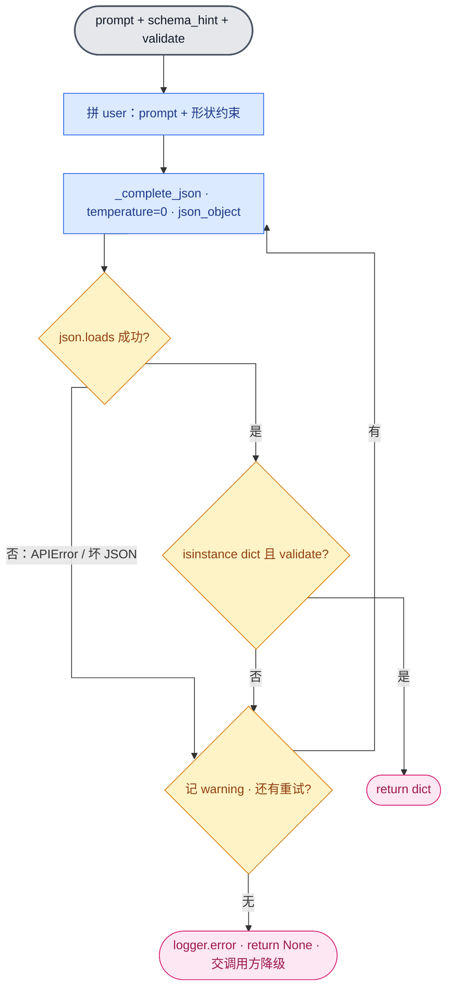

# alpha · T1 映射③核 详细设计（`_core/llm.py`）

| 项 | 内容 |
|---|---|
| 文档版本 | v0.1 |
| 日期 | 2026-06-06 |
| 上游 | [技术方案.md](./技术方案.md) §3 模块表、§4 映射③核、§5.6 降级、§9 任务表 T1 |
| 范围 | T1 的**函数级详细设计**：对外接口契约、prompt/schema 约定、降级语义、参考实现、验收标准。不含 T2–T14。 |

---

## 1. 职责与定位

把「不可信 LLM 输出 → 可信结构化数据」这层映射，封装成一个**通用模板函数**，供 T3–T8 的路由/理解/偏好/规划/取数/综合**全部复用**；再加一个文本透传的流式函数。

- **纯函数、无状态**：不持有任何对象、不跨调用存储，符合后端无状态契约。
- **刻意薄**：被调七八次，越薄越稳。所有"约束/校验/重试/降级"显式手写，不外包给 SDK 的 strict schema。

---

## 2. 对外接口（契约，T3–T8 依赖，勿改签名）

### 2.1 `generate_structured`

```python
def generate_structured(
    prompt: str,
    schema_hint: str,
    validate: Callable[[dict], bool],
    retries: int = 3,
) -> dict | None
```

| 参数 | 含义 | 约定 |
|---|---|---|
| `prompt` | 任务指令，「做什么」 | 不写输出格式，格式交给 `schema_hint` |
| `schema_hint` | 期望输出的 JSON 形状（人读描述），拼进 user 末尾 | 紧凑伪 JSON；**封闭枚举用 `\|` 列全**，如 `{"kind": "plan\|qa\|out_of_scope"}` |
| `validate` | 对解析出的 dict 做语义校验 | 只读、返回 `bool`；不要有副作用 |
| `retries` | 最多尝试次数（含首次） | 默认 3 |

**返回**：通过校验的 `dict`；`retries` 次仍失败返回 `None`。**永不抛异常**——失败用返回值 `None` 表达。

### 2.2 `stream_text`

```python
def stream_text(messages: list[dict], system: str | None = None) -> Iterator[str]
```

逐字 yield 文本增量。`messages` 直接是 `chat()` 入参（user/assistant）；`system` 由调用方按阶段注入（问答=友好助手口吻，拒答=能力边界引导）。

---

## 3. 内部结构（三层）

```
对外层   generate_structured          stream_text
            │  retries 循环                │  透传
IO 层       └──► _complete_json ◄──────────┘──► _client()
            （json_object 模式，唯一 mock 点）（构造 OpenAI 客户端，trust_env=False）
```

`_complete_json` 是**唯一碰网络的函数**，也是测试的唯一 mock 点：monkeypatch 它即可无 key、离线覆盖核心分支。

### 映射③模板循环（`generate_structured` 主体）



---

## 4. 关键设计决策

1. **约束与校验分离**：`json_object` 模式保「语法合法」，调用方传的 `validate` 保「语义正确」。两件不同的事，分开做——这正是映射③「schema 约束 vs 校验」的分工。
2. **异常分层，失败可见（不静默隐匿）**：区分两类失败——
   - **外部预期失败**（`APIError`：网络/超时/限流/状态码、坏 JSON、未过校验）：每次 `logger.warning`、重试；三次全废 `logger.error` 并降级返回 `None`，把"怎么降级"留给调用方（§5.6：追问 / 标"暂无法获取" / 朴素拼接）。
   - **非预期错误**（缺 `DEEPSEEK_API_KEY`、`validate` 自身 bug、编程错误）：**不 catch、向上抛**，由编排层 `chat()` 统一兜底成友好 text 并暴露堆栈。

   绝不用 `except Exception: continue` 这种"既不分类型、也不留痕迹"的吞没——缺 key 都会变成神秘的 `None`，是调试灾难。
3. **单一 IO mock 点**：唯一碰网络的地方收成 `_complete_json`，于是核心模板离线可测（§6）。
4. **不用 `json_schema(strict)`**：DeepSeek 不支持；且手写「约束→解析→校验→重试」本身就是串讲映射③要练的，不外包给 SDK。

---

## 5. 给调用方的约定（T3–T8 必读）

- **拿到 `None` 必须降级**，不能默认成功——每个阶段按 §5.6 给自己的降级分支。
- **schema 越封闭、`validate` 越严**（串讲 §3）：路由这种封闭枚举，`validate` 要 `data["kind"] in {...}`；取数这种开放形状，校验字段齐即可。
- `validate` 应**只做判定、不抛异常**：底座**不吞** `validate` 的异常，它会向上传播（视为调用方 bug，该暴露而非静默成"未通过"）。
- 结构化阶段固定 `temperature=0`（在 `_complete_json` 内写死）；自然语言流式用 `stream_text`（内部 `0.3`）。

---

## 6. 参考实现

```python
"""_core/llm.py —— alpha 的 LLM 底座（映射③核）。

generate_structured(): 约束 → 调用 → 解析 → 校验 → 重试 → 失败返回 None。
stream_text(): 纯文本逐字流式。

环境变量（与 agents/alpha/__init__.py 一致）：DEEPSEEK_API_KEY 必填 / LLM_BASE_URL / LLM_MODEL
"""

import json
import logging
import os
from collections.abc import Callable, Iterator

import httpx
from openai import APIError, OpenAI

try:
    from dotenv import load_dotenv

    load_dotenv()
except ImportError:
    pass

logger = logging.getLogger("alpha.llm")  # 只取 logger、不配 handler；warning+ 默认即可见
_MODEL = os.environ.get("LLM_MODEL", "deepseek-chat")


def _client() -> OpenAI:
    # DeepSeek 在国内，trust_env=False 绕开本机代理
    return OpenAI(
        base_url=os.environ.get("LLM_BASE_URL", "https://api.deepseek.com"),
        api_key=os.environ["DEEPSEEK_API_KEY"],
        http_client=httpx.Client(trust_env=False),
    )


def _complete_json(user: str) -> str:
    # 唯一对外 IO：json_object 模式保证返回合法 JSON 文本。测试就 mock 这一个函数
    resp = _client().chat.completions.create(
        model=_MODEL,
        messages=[{"role": "user", "content": user}],
        temperature=0.0,
        response_format={"type": "json_object"},
    )
    return resp.choices[0].message.content or ""


def generate_structured(
    prompt: str,
    schema_hint: str,
    validate: Callable[[dict], bool],
    retries: int = 3,
) -> dict | None:
    """映射③核。

    仅对「外部预期失败」重试并最终降级返回 None：API 调用失败（APIError）、
    JSON 解析失败、输出未过校验。每次失败记 warning，三次全废记 error——失败可见。

    非预期错误不在此吞没：缺 DEEPSEEK_API_KEY、validate 自身的 bug 等照常向上抛，
    交编排层 chat() 兜底成一条友好 text（§5.6）并暴露堆栈。
    """
    user = f"{prompt}\n\n只输出一个 JSON 对象，形状：\n{schema_hint}"
    for attempt in range(1, retries + 1):
        try:
            raw = _complete_json(user)
            data = json.loads(raw)
        except APIError as e:  # 网络/超时/限流/状态码：可重试的外部失败
            logger.warning("结构化调用失败 (%d/%d): %s", attempt, retries, e)
            continue
        except json.JSONDecodeError as e:
            logger.warning("JSON 解析失败 (%d/%d): %s | 原文: %.200s", attempt, retries, e, raw)
            continue
        if isinstance(data, dict) and validate(data):  # validate 在 try 外：异常向上抛
            return data
        logger.warning("输出未过校验 (%d/%d): %.200r", attempt, retries, data)
    logger.error("结构化连续 %d 次失败，降级返回 None", retries)
    return None


def stream_text(messages: list[dict], system: str | None = None) -> Iterator[str]:
    """纯文本逐字流式（普通问答 / 拒答 / 行程表输出用）。"""
    convo = [{"role": "system", "content": system}, *messages] if system else messages
    stream = _client().chat.completions.create(
        model=_MODEL, messages=convo, temperature=0.3, stream=True
    )
    for chunk in stream:
        delta = chunk.choices[0].delta
        if delta.content:
            yield delta.content
```

---

## 7. 验收标准

- **AC1 签名**：两个函数签名同 §2，后续阶段锁定。
- **AC2 模板齐全**：`generate_structured` 走完整「约束→解析→校验→重试→降级 None」，`temperature=0`。
- **AC3 失败分层且可见**：外部失败（坏 JSON、非 dict、`validate` False、`APIError`）每次记 `warning`、重试耗尽记 `error` 后返回 `None`；缺 key、`validate` 自身异常等**向上抛、不被吞**。
- **AC4 离线可测**：mock `_complete_json` 后，无 `DEEPSEEK_API_KEY`、不联网即可全绿。
- **AC5 规约**：`ruff check` 通过；零新增依赖（仅 `openai`/`httpx`/stdlib）。

**测试点**（`tests/test_alpha_llm.py`，mock `_complete_json`）：合法→返回 dict、坏 JSON→重试后成功、三次全废→`None`、`validate` 恒 False→`None`；`_complete_json` 抛 `APIError`→重试后降级 `None`、抛 `RuntimeError`（模拟缺 key）→`pytest.raises` 向上抛不被吞。`stream_text` 用假 `_client` 轻量 mock（验证 system 注入 + delta 转发）。共 8 个测试。

**离线验收命令**：

```bash
env -u DEEPSEEK_API_KEY uv run pytest tests/test_alpha_llm.py -v && uv run ruff check agents/alpha/_core/
```
