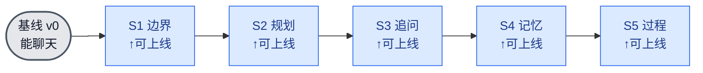

# alpha 任务拆分（垂直切片 · 可上线增量）

| 项 | 内容 |
|---|---|
| 文档版本 | v0.2 |
| 日期 | 2026-06-06 |
| 上游 | [PRD.md](./PRD.md)、[技术方案.md](./技术方案.md)、[T1 详细设计](./T1-映射核详细设计.md) |
| 关系 | 本文**取代技术方案 §9 的任务拆分**。§1–§8（架构 / 映射③ / 关键决策）仍是技术蓝图、有效。 |

---

## 0. 立场

按 **CI/CD 思想小步迭代，不憋大招**。具体四条：

1. **垂直切片**：每个任务纵向穿过 路由→逻辑→编排→（前端），交付一条**用户能看见、能验收**的完整路径。不按"一任务一文件"的水平分层切——那样要等所有模块接起来才第一次能跑，风险全压到集成那一刻。
2. **片片可上线**：每个切片做完 = 人工验收通过 + 必要的最小回归绿 → 即可合并主干、部署。中间任何一片停下，alpha 都是一个完整可用的版本，只是能力少一些。
3. **模块按需长出来**：技术方案里的 `intent / understanding / planner / capabilities / itinerary` 等模块，在切片推进中**撞到真实重复才就地抽**，不预先全建（避免 sse.py 那种提前封装）。
4. **自动化克制**：功能小、迭代快，不追求测试覆盖率。只在路由分支、schema 校验、SSE 契约、已踩坑点这些“LLM 输出接软件动作”的边界写最小回归；纯文案、prompt 风格、10 秒手测可确认的点不写。

> 为什么能这样起步：alpha 现状（`agents/alpha/__init__.py`）已是一个能流式聊天的 agent。它天然就是「普通问答 qa」的兜底，所以 qa **不单列切片**——路由判 qa 就走现有聊天。每个切片都在这个可用基线上**叠加**一个用户可感知的能力。

---

## 1. 切片总览

| 切片 | 用户能多做什么 | 主要触及 | 人工验收（输入 → 期望） | AC | 前端改动 |
|---|---|---|---|---|---|
| **S0 底座** | （无用户可见，**已完成**） | `_core/llm.py` | — | — | 无 |
| **S1 能力边界** | 问非出游会被礼貌拒答 | 路由 + 编排 | "帮我写首诗" → 礼貌拒答 + 引导；其余照常聊 | AC3 | 无 |
| **S2 最简规划** | 给城市+日期得到一份行程 | 路由 plan + 行程生成 + 编排 | "周六去杭州玩一天" → 一份行程表（含时效声明） | AC1、AC6 | 无 |
| **S3 缺失追问** | 信息不全会被问清 | 槽位判定 + 追问 | 只说"我想出去玩" → 反问城市/日期 | AC2 | 无 |
| **S4 记忆微调** | 不用重复说偏好、能增量调整 | 偏好抽取 + 增量规划 | "砍到3个景点""换辣的" → 方案跟着变、不重复追问 | AC4 | 无 |
| **S5 过程可见** | 看见规划进度、分方面更细 | 规划拆分 + status 事件 + 前端 | 规划时看到"正在看天气…" | AC5 | 小改 |

每个箭头都是一次「过 CI → 合并 → 可部署」。

---

## 2. 切片与模块对照

本文是任务拆分，不替代技术方案的模块设计。为避免只看任务拆分找不到功能模块，先给对照：

| 切片 | 会长出的功能模块 | 暂不抽的模块 |
|---|---|---|
| S1 | `intent`（可先内联在 `__init__.py`）、编排分支 | 独立 `sse.py` |
| S2 | `itinerary` 或 plan 分支内的行程 schema/渲染 | `planner` / `capabilities` |
| S3 | `understanding`：槽位、缺失判定、追问 | 复杂多轮状态机 |
| S4 | `preferences`、增量规划判定 | 持久化记忆 |
| S5 | `planner` / `capabilities` / `sse.py`、前端 status 渲染 | 真实外部数据源 |

---

## 3. 每片详述

> 共同的**完成判据（DoD = 可上线）**：① 人工验收通过；② 若本片触碰路由/schema/SSE 契约/踩坑点，补最小回归用例，且不破坏既有测试；③ 以若干小 commit 合入主干。
> 详细设计（prompt 文案、schema 字段、降级文案）在**每片开工时**才做（像 T1 那样），不在本文提前固化。
> `mock` 边界：只 mock LLM/网络 IO，让测试离线、确定、低心智负担；不 mock 业务流程本身。

### S0 底座（已完成）
`generate_structured` + `stream_text`。是 S1 第一行就要调的零件。commit `406e68d`。

### S1 能力边界
- **故事**：用户问与出游无关的事，alpha 礼貌说明自己只做一日游规划，而非答非所问或强行规划。
- **做什么**：在 `chat()` 入口加一次路由（`generate_structured`，封闭枚举 `plan|qa|out_of_scope`，校验最严）。`out_of_scope` → `stream_text` 吐一句拒答；`plan`/`qa` 本片都先走现有聊天兜底。
- **人工验收**：输入"帮我写首诗" → 拒答 + 引导回出游；输入"你好" → 正常聊天。
- **最小回归**：mock LLM/网络 IO，覆盖三类路由分支；降级（None）→ 兜 qa。
- **建议 commit**：①路由分类（含 prompt+校验）+ 最小回归 → ②接进 chat 的 out_of_scope 分支 → ③拒答文案。

### S2 最简规划
- **故事**：给齐"城市+日期"，得到一份可读的一日行程表。
- **做什么**：路由判 `plan` → **一次 LLM 出整份行程**（概览/时间轴/餐饮/路线/预算/贴士/时效声明，§7 七段），`stream_text` 流式输出。**先不拆**天气/景点/餐饮多模块——整份一次出，跑通"输入→行程表"闭环。
- **人工验收**：输入"周六去杭州玩一天" → 一份含时间轴 + 末尾"信息仅供参考"的行程。
- **最小回归**：只守行程 schema 七段齐；降级（综合失败）→ 朴素文本兜底。
- **建议 commit**：①plan 分支 + 行程 schema/校验 + 最小回归 → ②prompt + 接进 chat 流式输出 → ③时效声明。

### S3 缺失追问
- **故事**：信息不全时一次性问清，补全后继续完成方案。
- **做什么**：plan 分支前加槽位抽取 + 缺失判定（缺城市/日期）→ 一次性追问文案；齐则进 S2 规划。多轮靠无状态 + 前端带全 `messages` 自然衔接。
- **人工验收**："我想出去玩" → 反问城市和日期；补"杭州 周六" → 出行程。
- **最小回归**：只守缺城市/缺日期/都缺 → 触发追问；齐 → 放行。
- **建议 commit**：①槽位抽取+缺失判定+最小回归 → ②追问文案 + 接进 chat。

### S4 记忆微调
- **故事**：记住对话内说过的偏好，后续不重复追问；能基于上一版方案增量调整。
- **做什么**：每轮 `preferences.extract(messages)` 重建显式偏好对象注入下游（§5.1）；plan 检测 `messages` 内已有上一版行程 → 以它为基线做增量，而非从零（§5.2）。
- **人工验收**：先出一版 → "砍到3个景点" → 只改景点数、其余不变；"换辣一点的" → 餐饮变、不再问忌口。
- **最小回归**：只守偏好对象重建、增量分支命中判定。
- **建议 commit**：①偏好抽取+合并+最小回归 → ②注入下游 → ③规划增量判定。

### S5 过程可见
- **故事**：规划过程有进度反馈，且分方面更细（天气/景点/餐饮）。
- **做什么**：把 S2 的"一次出整份"拆成分步（天气→景点→餐饮→综合），每步前发 `status` 事件；**此时才**就地抽 SSE helper（撞到重复了）；前端 `api.ts`/`page.tsx` 解析 status、渲染临时进展行，`done` 后折叠（§5.3）；同步更新 `docs/api-contract.md`。
- **人工验收**：规划时依次看到"正在看天气…/找景点…"，最后出结构化行程表。
- **最小回归**：后端 status 行格式符合契约；前端 status 解析+渲染（vitest）。
- **建议 commit**：①规划分步+status（后端）+最小回归 → ②契约更新 → ③前端解析+渲染+最小回归。

---

## 4. 与技术方案的对照

- **保留**：技术方案 §1–§8（接口约束、确定性流水线、映射③核、关键设计决策、错误降级、测试策略、YAGNI 边界）。
- **取代**：§9 任务拆分（水平分层 T1–T14）→ 本文 S0–S5（垂直切片）。原 T3–T8 的模块在 S1–S5 中按需就地长出。
- **不在本文做**：每片的函数签名 / schema 字段 / prompt 文案——留到各片开工时的详细设计轮。

---

## 5. 一句话

**每片都是一个能 demo、能验收、能上线的 alpha；问题在每片暴露、在每片收敛，而不是攒到最后一次性集成。**
