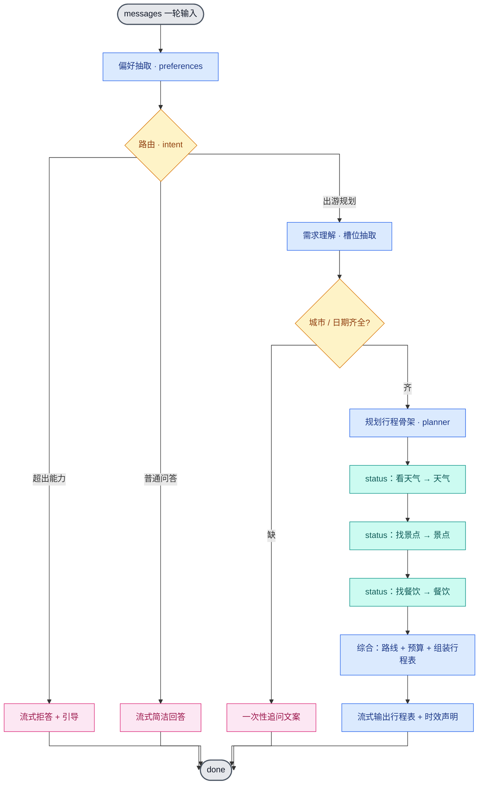
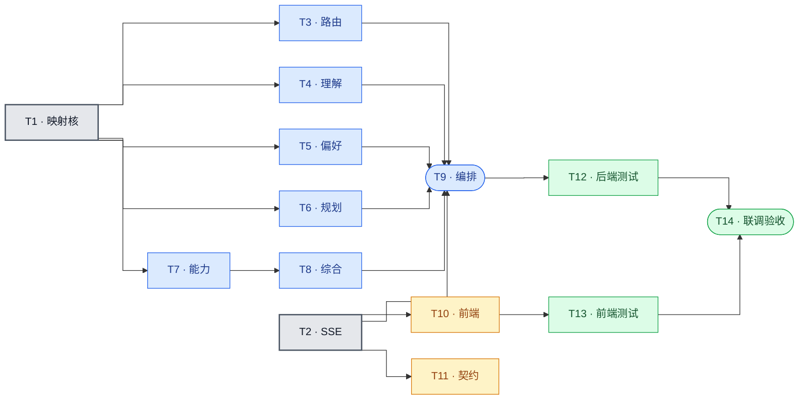

# alpha 技术方案 · 一日游规划助手（架构 + 任务拆分）

| 项 | 内容 |
|---|---|
| 文档版本 | v0.1（草稿） |
| 日期 | 2026-06-06 |
| 状态 | 待评审 |
| 上游 | [PRD.md](./PRD.md)、[lessons 横向串讲](../lessons横向串讲-从映射看1-10.md) |
| 范围声明 | **本文只给架构（模块划分）、技术选型、关键设计决策与任务拆分；不含代码实现，也不含函数级详细设计（schema 字段、prompt 文案、签名）。** 详细设计与实现在后续独立轮次。 |

---

## 0. 设计立场（一句话）

alpha 是**学习型 agent**：用「一日游规划」这个真实场景，从第一性原理手写串讲里的**映射③**——在「不可信的 LLM 输出」和「软件执行」之间，建一层 *schema 约束 → 校验 → 校验后动作* 的映射。**不引入任何新框架**（只用现有 `openai` SDK + stdlib），**不参考 bravo 的实现**，复用现有无状态 SSE 骨架。

设计的两条铁律（来自项目 PHILOSOPHY 与串讲 §4–§5）：

1. **最小可运行优先，不过度设计**：能用确定性代码就不用自主循环；evals/telemetry/真实数据源都不在本期。
2. **没有魔法**：所有"理解/决策/规划/记忆"都拆成 *schema→校验→校验后动作* 的组合，状态全部显式可见。

---

## 1. 与现有骨架的接口（已知约束）

| 约束 | 事实 | 对 alpha 的影响 |
|---|---|---|
| 入口契约 | `agents/alpha/__init__.py` 暴露 `chat(messages: list[dict]) -> Iterator[str]`，吐 SSE `data: {...}\n\n` 行 | alpha 全部实现收敛到这一个生成器入口 |
| 会话历史 | S1–S3 后端不存历史；S4 起接入共享 PostgreSQL 会话消息存储 | 偏好微调先从会话历史重建显式对象，不依赖进程内存 |
| SSE 事件 | 现有 `text` / `tool_call` / `tool_result` / `done`；契约写明"各 agent 至少发 `text`/`done`，其余按需" | 允许按需新增 `status` 事件做进展可见（§5.3） |
| 前端 | `frontend/src/agents/alpha/` 的 `api.ts`/`page.tsx` 当前**只渲染 `text`/`done`** | 过程可见需小改前端解析 + 渲染（T11） |
| 依赖 | S4 前仅 `fastapi/uvicorn/openai/python-dotenv` + stdlib；S4 起新增 `psycopg[binary]` | 不引入 ORM |

> 注：串讲引用的 `agent.py/planner.py` **不在本仓库**（只在 bravo 的 `_chain/` 下有同名文件）。故 lesson 1–10 在本方案中是**概念蓝本**，从零手写，不 import、不抄 bravo。

---

## 2. 顶层形态：确定性流水线 + 对话级微调循环

**一轮 `chat()` = 一条固定阶段的确定性流水线**；每个需要"理解/判断/生成"的阶段 = **一次映射③结构化调用**。多轮微调（F5）走**对话级循环**：前端每轮带完整 `messages`，后端每轮重抽偏好、重跑流水线，微调时以上一版行程表（在 `messages` 里）为基线增量调整。



**为什么是确定性流水线，而不是自主 agent 循环？**

| | 确定性流水线（**采用**） | 自主 agent 循环（不采用） |
|---|---|---|
| 形态 | 固定阶段编排，planner 只动态决定**行程结构**（景点数随节奏、是否含某方面） | planner 产出动态步骤，`run_loop(done+max_steps)` 自主执行、模型决定下一步 |
| 可靠性 | 高（每阶段输入输出可预期、可单测） | 低（步骤漂移、循环失控、难调试） |
| 仍练到的能力 | 理解 / 路由 / 规划 / 调用 / 综合 / 记忆（已覆盖 PRD 全部能力链） | 额外练 lesson9/10 原子动作/依赖图 |
| 契合度 | 贴 "最小可运行优先"；进展可见已满足"像 agent"的体感 | 偏离最小可运行，收益（DAG）当前场景用不上 |

行程的方面间确有弱依赖（路线依赖景点、预算依赖前面），但**固定顺序**（天气→景点→餐饮→路线→预算）即可满足，无需 lesson10 的依赖图 DAG。这是一处刻意的"不过度设计"。

---

## 3. 模块划分

落在 `agents/alpha/` 下，`__init__.py` 保持瘦（只做编排），实现收进私有 `_core/` 子包（外部不 import）：

```
agents/alpha/
├── __init__.py          编排入口 chat()：装配流水线、按阶段驱动 SSE。瘦。
└── _core/
    ├── llm.py           LLM 封装 + generate_structured()（映射③核）+ stream_text()
    ├── sse.py           SSE 事件封装：text / status / tool_result / done，统一 data: 行
    ├── intent.py        F2 路由（decide）：出游规划 / 普通问答 / 超出能力
    ├── understanding.py F1 需求理解：槽位抽取 + 缺失判定 + 追问文案
    ├── preferences.py   F5 偏好记忆：从 messages 抽取并合并成显式 preferences 对象
    ├── planner.py       F3 规划：据需求+偏好产出"行程骨架"（方面、景点数、顺序）
    ├── capabilities.py  F3 能力：天气/景点/餐饮（当前=LLM 合成，留真实数据源接口）
    └── itinerary.py     F3+F4 综合：路线+预算+组装结构化行程表，并渲染为文本
```

每个模块都满足"单一职责、接口清晰、可独立测试"。下表给出**职责 / 对外接口形态 / 依赖**（不写签名细节，留给详细设计轮）：

| 模块 | 职责 | 对外接口（形态） | 依赖 |
|---|---|---|---|
| `llm.py` | 映射③公共模板：约束输出 + 解析 + 校验 + 重试 + 降级；以及纯文本流式 | `generate_structured(...)→dict\|None`、`stream_text(...)→Iterator[str]` | `openai`、stdlib |
| `sse.py` | 把事件转成 `data: {json}\n\n` 行 | `text()/status()/tool_result()/done()` | stdlib |
| `intent.py` | 三分类路由 | `route(messages)→Literal["plan","qa","out_of_scope"]` | `llm` |
| `understanding.py` | 抽槽位 + 判缺失 + 生成追问 | `extract_slots(messages)→Slots`、`missing(slots)→list`、`ask(missing)→str` | `llm` |
| `preferences.py` | 跨轮偏好抽取+合并（显式对象） | `extract(messages)→Preferences` | `llm` |
| `planner.py` | 行程骨架（方面集、景点数、顺序） | `plan(slots, prefs)→Plan` | `llm` |
| `capabilities.py` | 天气/景点/餐饮取数（当前 LLM 合成） | `weather()/spots()/dining()→dict` | `llm` |
| `itinerary.py` | 综合路线+预算 + 组装行程表 + 文本渲染 | `compose(...)→Itinerary`、`render(itin)→str` | `llm` |
| `__init__.py` | 编排：偏好→路由→（理解→规划→取数→综合）/问答/拒答，按阶段发 SSE | `chat(messages)→Iterator[str]` | 上述全部 |

> 取舍：schema 与校验函数**随其阶段模块就近定义**（不单设 `schemas.py`），换取内聚；代价是"数据形状演进"分散，由本文 §4 的总表补回全局视角。若某模块过薄（如 `intent`），实现时可并入 `understanding`——保留 YAGNI 弹性。

---

## 4. 映射③核：同一套模板，三处可变项

全部结构化阶段复用 `llm.generate_structured(prompt, schema_hint, validate, retries=3)`，内部即串讲 §1 的公共模板：

```
prompt（注入 schema 约束） → temperature=0.0 → for _ in range(3): 调 LLM → 抽 JSON → validate → 命中即返回 → 全失败则降级
```

逐阶段的三处可变项（schema / 校验 / 校验后动作）——这张表是 alpha 的"映射地图"：

| 阶段 | 模块 | schema（形状） | 校验（强度） | 校验后动作 |
|---|---|---|---|---|
| 路由 | `intent` | `{kind: 枚举[plan/qa/out_of_scope]}` | `kind ∈ 枚举`（**最严**，封闭枚举） | 分支：规划 / 问答 / 拒答 |
| 理解 | `understanding` | `{city,date,companions,budget,interest,pace}` | city/date 缺失判定（中） | 缺→追问；齐→进规划 |
| 偏好 | `preferences` | `{diet,budget_tier,pace,interests:[],avoid:[]}` | 类型/容器检查（中） | 合并成显式 prefs，注入下游 |
| 规划 | `planner` | `{aspects:[], n_spots:int, order:[]}` | `aspects ⊆ 固定集` 且 `n_spots>0`（中） | 存本轮 Plan，驱动取数顺序 |
| 取数 | `capabilities` | 各方面 schema（如 `weather{...}`/`spots[...]`/`dining{...}`） | 各自字段齐（弱–中） | 填进行程表草稿 |
| 综合 | `itinerary` | 行程表 schema（§7 七段：概览/时间轴/餐饮/路线/预算/贴士/声明） | 七段齐（中） | 渲染为文本，流式输出 |

**强度梯度的规律（串讲 §3）**：schema 越封闭，校验越严。路由用封闭枚举所以最严、最可靠；取数/偏好形状开放所以校验偏弱。**设计原则：能约束成封闭枚举就别留开放结构**——路由、节奏档、预算档都按枚举设计。

显式状态对象（串讲 §1"显式数据存哪"）：`Slots` / `Preferences` / `Plan` / `Itinerary`。
S4 后会话消息落共享 PostgreSQL；偏好、计划、行程仍是每轮从历史重建的普通对象。

---

## 5. 关键设计决策

### 5.1 偏好记忆：从会话历史重建显式对象

**约束**：S4 前历史只存在前端 `messages`；S4 后历史存入共享 PostgreSQL。
两种形态下，下游都不直接靠 LLM 隐式翻历史。

**决策**：`preferences.extract(messages)` 每轮从会话历史抽出**显式 `Preferences` 对象**（忌口/预算档/节奏/兴趣/避免地点），供下游按字段读取。

- 这满足串讲要求：它是"显式存储"（结构化对象，下游按字段读，**不靠模型隐式重读原始历史**）。
- **取舍**：放弃 lesson7 的进程级 `Memory.items` 写法；跨请求历史交给 PostgreSQL，业务偏好仍每轮重建。
- **已知边界（串讲 §3/§5）**：记忆随对话增长，全量注入终会撑爆上下文。学习阶段消息量小，可接受；**截断/检索列为未来项**。

### 5.2 多轮微调：不新增"微调"意图，规划阶段做增量

PRD F5 要"基于上一版方案增量微调"。**决策**：路由仍判 `plan`；`planner` 阶段检测 `messages` 里是否已有上一版行程表（上一条 assistant），有则以它为基线 + 合并本轮新反馈/偏好做增量，而非从零重排。**少加一个意图分支，降复杂度**。

### 5.3 过程可见：新增轻量 `status` 事件 + 小改前端

**决策**：后端在每个 capability 前发 `{type:"status", stage, label}`（如 `stage="weather"`, `label="正在看天气…"`）；前端 alpha 解析它、渲染为**临时进展行**，`done` 后折叠/清除，与最终结构化行程表视觉分离。

- 契约允许"按需"扩展事件类型，故新增 `status` 合规；需同步更新 `docs/api-contract.md`（T12）。
- 备选（纯 `text` 流式进展、零前端改动）被否：进展文字会污染最终行程表气泡，二者无法分离，违背 F4"结构化产出"。
- 前端改动很小：`api.ts` 加 `status` 解析 + `onStatus` 回调，`page.tsx` 加临时进展行（T11）。

### 5.4 能力函数：当前 LLM 合成，接口为真实数据源预留

PRD §11 把真实数据源列为未来项、当前信息为"参考性"。**决策**：`capabilities` 当前用 **LLM 合成**参考信息（如"杭州 6 月多雨，带伞"），但**封装成 `get_weather(city,date)->dict` 的能力函数形状**；未来把内部 LLM 调用换成真实 API，签名不变。这正是串讲 §3"执行是占位 / 接口预留"的诚实落地——文档明确标注当前为合成、非实时。

行程表必带**时效声明**（"信息仅供参考"），满足 AC6。

### 5.5 LLM 调用次数与顺序

一轮规划约 **6–7 次串行结构化调用**：偏好 1 + 路由 1 + 理解 1 + 天气 1 + 景点 1 + 餐饮 1 + 综合 1。

- 路线/预算**不单独取数**，并入 `itinerary` 综合阶段一次算清——因为它们依赖景点结果，顺序天然，且减少调用。
- 串行 + `status` 进展反馈，等待感由 F4 的可见性缓解。**合并调用 / 并行 capability 列为未来优化项**（当前优先清晰可靠）。

### 5.6 错误处理 / 降级（永不把裸异常吐给前端）

`generate_structured` 三次重试后仍失败 → 该阶段降级，且全程把任何失败转成一条 `text` + `done`，保证前端不挂：

| 失败阶段 | 降级策略 |
|---|---|
| 路由 | 退化为 `qa` 或追问澄清 |
| 理解 | 转为追问 |
| 某 capability | 该方面标"暂无法获取"，行程表照出（缺一方面不致命）+ 时效声明 |
| 综合 | 退化为把各方面文本朴素拼接 |

---

## 6. 测试策略（轻量·学习级）

沿用现有 `pytest`（后端）/ `vitest`（前端）。**只测确定性骨架，不测 LLM 输出质量**（那是 eval，属串讲 §4 的"守映射"，本期不做）。

后端（mock LLM）：
- 映射③核：坏 JSON → 重试 → 降级路径。
- 路由：三类输入分类正确。
- 槽位缺失判定：缺城市/日期 → 触发追问。
- 偏好抽取：多轮 `messages` → 正确 `Preferences`。
- SSE 行格式：`text`/`status`/`done` 符合契约。

前端：
- `status` 事件解析 + 进展行渲染（扩展现有 `agent-api-contract.test.ts` 风格）。

联调：跑通 AC1–AC6（§8）。

---

## 7. 明确不做（YAGNI 边界）

| 不做 | 依据 |
|---|---|
| lesson10 依赖图 DAG、自主 `run_loop` | 固定顺序够用（§2） |
| evals / telemetry | 守映射，学习阶段过度工程（串讲 §4–§5） |
| 真实数据源 / 预订 / 支付 / 导航 | PRD 非目标 / §11 未来项 |
| 长期用户画像、地图可视化、行程导出 | PRD §11 未来项 |
| 任何新框架、ORM、markdown 渲染库 | S4 只新增 PostgreSQL 驱动；行程表用纯文本时间轴清单，前端 `whitespace-pre-wrap` 直显 |

---

## 8. 验收映射（AC → 模块）

| 验收 | 落到 |
|---|---|
| AC1 字段完整方案 | `understanding`+`planner`+`capabilities`+`itinerary` 全链 |
| AC2 缺失追问后续完成 | `understanding`（缺失判定+追问）+ 对话级循环 |
| AC3 非出游识别+礼貌拒答 | `intent`（out_of_scope 分支） |
| AC4 复用偏好不重复追问 | `preferences`（每轮重建）+ §5.2 增量 |
| AC5 过程可见+结构化 | `status` 事件（§5.3）+ `itinerary` 渲染 |
| AC6 时效声明 | `itinerary` 末尾固定声明（§5.4） |

---

## 9. 任务拆分

每个任务可独立交付 + 单测。依赖：**P0 → P1/P2 并行 → P3 → P4**。

| ID | 任务 | 产物 | 依赖 |
|---|---|---|---|
| **P0 基础设施** | | | |
| T1 | 映射③核 | `_core/llm.py`：`generate_structured`（约束+校验+重试+降级）+ `stream_text` | — |
| T2 | SSE 封装 | `_core/sse.py`：`text/status/tool_result/done` | — |
| **P1 理解层（F1/F2）** | | | |
| T3 | 路由 | `_core/intent.py`（含 schema+校验） | T1 |
| T4 | 需求理解 | `_core/understanding.py`：槽位抽取+缺失追问 | T1 |
| T5 | 偏好记忆 | `_core/preferences.py`：抽取+合并 | T1 |
| **P2 规划+执行（F3）** | | | |
| T6 | 规划 | `_core/planner.py`：行程骨架（含增量微调判定） | T1 |
| T7 | 能力取数 | `_core/capabilities.py`：天气/景点/餐饮（LLM 合成，留接口） | T1 |
| T8 | 综合渲染 | `_core/itinerary.py`：路线+预算+组装+文本渲染 | T1、T7 |
| **P3 编排+呈现（F4）** | | | |
| T9 | 编排入口 | `agents/alpha/__init__.py`：`chat()` 串流水线 + 驱动 SSE/status | T2–T8 |
| T10 | 前端进展 | `frontend/src/agents/alpha/` `api.ts`/`types.ts`/`page.tsx`：`status` 解析+进展行 | T2 |
| T11 | 契约更新 | `docs/api-contract.md` 补 `status` 事件 | T2 |
| **P4 测试+收尾** | | | |
| T12 | 后端测试 | 映射③核/路由/追问/偏好/SSE 格式 | T1–T9 |
| T13 | 前端测试 | `status` 解析+渲染 | T10 |
| T14 | 联调验收 | 跑通 AC1–AC6 | 全部 |



> T3–T7 之间相互独立（仅共享 `llm`），可并行实现。

---

## 10. 风险与待确认

| # | 项 | 当前默认 / 倾向 | 何时需重定 |
|---|---|---|---|
| 1 | 串行 6–7 次 LLM 调用的延迟 | 接受（status 缓解）；合并/并行列未来项 | 实测等待感差时 |
| 2 | 偏好全量注入的上下文增长 | 学习阶段可接受 | 长对话撑爆窗口时上截断/检索 |
| 3 | 城市范围（PRD OQ1：国内/不限） | 不限（prompt 不设限） | 评审指定时 |
| 4 | 是否动前端（T10/T11） | 做小改（§5.3） | 若坚持零前端改动→退纯 text 进展 |
| 5 | 行程表分项预算明细（PRD OQ4） | 分项+合计（§7 行程表 schema 预留） | 评审改为仅总额时 |

---

## 11. 下一步

本文为**技术方案 + 任务拆分**，到此为止（不含代码、不含函数级详细设计）。评审通过后，下一轮可对 T1–T14 逐个做详细设计（schema 字段、prompt 文案、函数签名）并实现，建议用 `writing-plans` 把本拆分转成可执行的实现计划。
